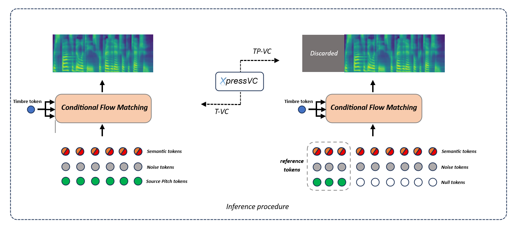

##  XpressVC: Expressive Voice Conversion With Joint Timbre and Prosody Transfer  <a src="https://img.shields.io/badge/cs.CV-2311.04693-b31b1b?logo=arxiv&logoColor=red" href="http://arxiv.org/abs/2311.04693"> 

The official Pytorch implementation of XpressVC
   
Soheil Khalesy

<em> Overall architecture </em>

> Although voice conversion (VC) systems have shown a remarkable ability to transfer voice style, existing methods still have an inaccurate pitch and low speaker adaptation quality. To address these challenges, we introduce Diff-HierVC, a hierarchical VC system based on two diffusion models. We first introduce DiffPitch, which can effectively generate $F_0$ with the target voice style. Subsequently, the generated $F_0$ is fed to DiffVoice to convert the speech with a target voice style. Furthermore, using the source-filter encoder, we disentangle the speech and use the converted Mel-spectrogram as a data-driven prior in DiffVoice to improve the voice style transfer capacity. Finally, by using the masked prior in diffusion models, our model can improve the speaker adaptation quality. Experimental results verify the superiority of our model in pitch generation and voice style transfer performance, and our model also achieves a CER of 0.83\% and EER of 3.29\% in zero-shot VC scenarios.

## 🎧 Audio Demo
https://skh82.github.io/XpressVC/
